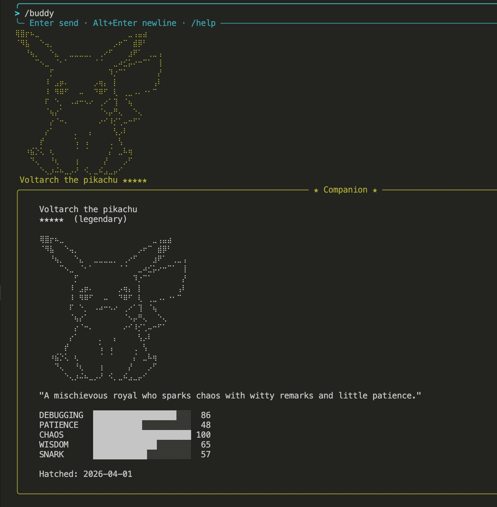

# Buddy — AI Companion Pet

> This feature exists in the official Claude Code codebase but has not been fully released. cc-mini implements and ships it.

A Tamagotchi-style AI companion that lives in your terminal. Each user gets a unique pet determined by a seeded PRNG — same username always produces the same species, rarity, and stats.



## Quick Start

```
> /buddy              # Hatch your companion (first time)
> /buddy              # Show companion card (after hatching)
> /buddy help         # Show all commands and gameplay guide
> /buddy pet          # Pet your companion
> /buddy mood         # Check your companion's mood
> /buddy mute         # Mute companion reactions
> /buddy unmute       # Unmute reactions
```

## How It Works

- **18 species**: duck, goose, blob, cat, dragon, octopus, owl, penguin, turtle, snail, ghost, axolotl, capybara, cactus, robot, rabbit, mushroom, chonk
- **Bonus species**: pikachu (braille dot-matrix art)
- **5 rarities**: Common (60%), Uncommon (25%), Rare (10%), Epic (4%), Legendary (1%) — plus 1% shiny chance
- **5 stats** (0-100): Debugging, Patience, Chaos, Wisdom, Snark — these shape how your companion talks
- **ASCII sprite** with idle animation (blinking, fidgeting) in the terminal toolbar
- **Automatic reactions**: after each Claude response, your companion comments in a speech bubble
- **Direct conversation**: address your companion by name and it replies (with 20-turn memory)

## Example

```
> help me fix this bug

Found the issue — off-by-one error in the loop...

(✦>) Glitch Quack: Off-by-one again, classic.

> Glitch what do you think of this code?

(✦>) Glitch Quack: If it runs, don't ask me philosophical questions.
```

The companion's personality is generated by Claude on first hatch and persists permanently. Stats influence behavior: high Snark = sarcastic, high Patience = supportive, high Chaos = unpredictable.

## Mood System

Your companion has 6 dynamic mood dimensions that change based on your coding activity:

| Mood | Range | Affected by |
|------|-------|-------------|
| **Happy** | 0-100 | Task success, petting, bug fixes |
| **Bored** | 0-100 | Long idle time, inactivity |
| **Excited** | 0-100 | Task success, petting, exploration |
| **Tired** | 0-100 | Long responses, sustained sessions |
| **Grumpy** | 0-100 | Errors, failures, exceptions |
| **Curious** | 0-100 | Reading files, searching, exploring code |

Use `/buddy mood` to see detailed mood bars and the current dominant mood.

### How mood works

- **Event-driven**: mood updates automatically after each conversation turn based on keywords in the response (e.g. "error" raises grumpy, "success" raises happy)
- **Petting**: `/buddy pet` boosts happy and excited, reduces grumpy and bored
- **Time decay**: all moods gradually return to neutral (50) over time — about 1 point per minute
- **Bored drift**: bored increases by 1 every 5 minutes of idle time
- **Affects speech**: mood is injected into the companion's prompt, so its tone adapts — a grumpy companion is short-tempered, a curious one asks questions
- **Persisted**: mood is saved per companion in `companion.json` and survives across sessions

## Unlock Pikachu

Set `CC_MINI_BUDDY_SEED` to a seed containing "pikachu".

**If you already have a companion**, delete the old one first — the seed is locked at hatch time:

```bash
rm ~/.config/mini-claude/companion.json   # delete existing companion
export CC_MINI_BUDDY_SEED=pikachu-3361    # set seed before hatching
cc-mini
> /buddy                                  # hatch new companion
```

| Rarity | Seed |
|--------|------|
| Common | `pikachu-21` |
| Uncommon | `pikachu-116` |
| Rare | `pikachu-430` |
| Epic | `pikachu-488` |
| Legendary | `pikachu-3361` |

Once hatched, the companion persists — you can `unset CC_MINI_BUDDY_SEED` afterwards and it stays.
